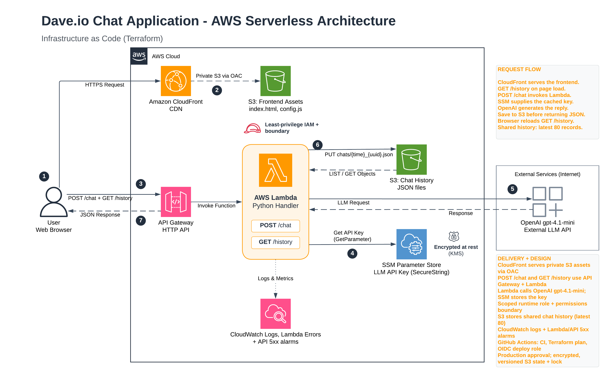

# Dave.io / ask-dave

I built this chat app on AWS with Terraform. The supplied
`takehomeassignmentdave_io/index.html` is unchanged; deployment generates the
adjacent `config.js` with the API URL.

**Quick review:** start with [status](#status), then [architecture](#architecture-and-choices).
To deploy it in another AWS account, follow [first-time setup](#first-time-setup)
and [deploy](#deploy). The first setup requires an AWS administrator; routine
deployments use a scoped role, not root credentials.

## Status

The app is live, and I've tested the chat in the browser. It uses `gpt-4.1-mini`,
saves each exchange to S3, and loads those exchanges through `/history`.

The deployment checks confirm that the original frontend is served over HTTPS,
`config.js` points to the API, and history returns JSON with the expected CORS
origin. A live `/chat` request returned HTTP 200, and its response showed up in
history afterward.

CI/CD is working too. The [first successful release](https://github.com/SupremeDataLabs/dave.io/actions/runs/37228638822)
completed on October 4, 2026. GitHub authenticated to AWS through OIDC, generated
a plan with no infrastructure changes, and applied that saved plan after
production approval. The frontend, configuration, and history checks all passed.
Terraform state is now in an encrypted, versioned S3 bucket with locking.

CloudWatch logs and error alarms are set up. I still need to test an alarm
transition, deployment into a clean AWS account, and a full teardown.

## Architecture and choices



S3 stores the chat exchanges; `/history` returns the latest 80 records.

I chose CloudFront to serve the frontend over HTTPS without needing a custom
domain. Origin access control keeps its S3 bucket private, and a separate bucket
holds chat history.

Lambda and HTTP API fit the two routes without an always-on server. I used one
JSON object per exchange in S3 to keep storage simple and avoid adding a database.
That keeps idle costs low, though storage and other usage can still incur charges.

I separated deployment permissions from Lambda's runtime permissions. Lambda has
a scoped execution policy and a permissions boundary, while a separate role uses
temporary credentials to provision resources. SSM stores the key encrypted;
Terraform uses an ephemeral variable and a write-only parameter value to avoid
saving it in state or plans. Never commit state, plans, credentials, or API keys.

## First-time setup

You need Terraform 1.11 or newer (below 2.0), Python 3.10+, AWS CLI v2, an AWS
account, and a funded OpenAI API key. The default region is `us-east-1`.

For a fresh account, an administrator first creates the deployment role and its
permissions boundary. Use temporary administrator credentials for this one-time
bootstrap—never root access keys:

```bash
AWS_PROFILE=YOUR_BOOTSTRAP_PROFILE terraform -chdir=infra/bootstrap init
AWS_PROFILE=YOUR_BOOTSTRAP_PROFILE terraform -chdir=infra/bootstrap apply
```

Next, configure a CLI profile to assume the bootstrap output `deployment_role_arn`
through your IAM Identity Center source profile. The permission set defaults to
`ask-dave-TerraformAccess` (configurable in bootstrap). Use that deployment profile
for the application command below. `Dave.io` and `Dave.io-bootstrap` are local
profile-name examples, not portable credentials. If you change regions, configure
both Terraform stacks consistently.

## Deploy

```bash
AWS_PROFILE=YOUR_DEPLOYMENT_PROFILE python3 scripts/deploy.py --enable-chat
```

Enter the OpenAI key at the hidden prompt, review the saved Terraform plan, and
confirm. The script builds Lambda, applies the plan, checks frontend bytes,
configuration and history, and prints the HTTPS URL. Send a chat message afterward
to check the LLM connection as well. The default model is `gpt-4.1-mini`; set
`TF_VAR_llm_model` to configure it.

For key rotation, increment `TF_VAR_llm_key_version` when deploying the new key;
keep it unchanged on ordinary releases. The version is not the secret itself.

## CI/CD: checks, plan, approval, apply

Pull requests run tests, a supplied-HTML checksum check, deterministic packaging,
and Terraform formatting/validation without cloud credentials. On `main`, GitHub
uses OIDC to create a Terraform plan, pauses for production approval, then applies
that exact plan. The workflow smoke-checks the frontend, generated config, and
`/history`; it does not call the paid model or verify browser behavior on every
release. The first successful release is recorded [here](https://github.com/SupremeDataLabs/dave.io/actions/runs/37228638822).

The details below are for someone enabling delivery in a fresh repository/account.
They are not needed to review the app or run a local deployment.

<details>
<summary>One-time GitHub Actions and remote-state setup (administrator)</summary>

The workflow serializes releases without cancelling an active apply; S3 locking
also coordinates CLI operations.

Official actions are pinned to commit SHAs. The workflow does not use
`pull_request_target`, expose AWS access to fork PRs, or store long-lived AWS
credentials in GitHub. The planning role trusts only this repository's `main`
branch. The deployment role trusts only its `production` environment; GitHub's
environment branch rule must restrict that environment to `main`.

1. Configure GitHub environment `production` with a required reviewer, only
   `main` allowed, and administrator bypass disabled. This is continuous delivery:
   a human reviews the plan and approves AWS changes. A solo maintainer must allow
   self-review; a team should require another reviewer.
2. Check whether the account already has the GitHub OIDC provider. In bootstrap,
   set `enable_delivery = true` and `github_repository` to your repository; set
   `existing_github_oidc_provider_arn` if reusing one. Set
   `github_oidc_subject_prefix` to the exact `sub_claim_prefix` returned by
   `gh api repos/OWNER/REPO/actions/oidc/customization/sub`. New repositories use
   immutable owner/repository IDs in this prefix; using the older name-only
   format causes AWS authentication to fail. See [GitHub's OIDC reference](https://docs.github.com/en/actions/reference/security/oidc#immutable-subject-claims).
   Keep these settings in a
   private local tfvars file on subsequent bootstrap runs. Review and apply
   bootstrap using an administrator identity permitted to create the new IAM
   roles, OIDC provider, and state bucket.
3. Freeze manual applies, back up local application state privately, and create
   the ignored `infra/remote-backend.tf.json` with the following configuration,
   replacing the bucket with bootstrap's `delivery_state_bucket` output:

   ```json
   {"terraform":{"backend":{"s3":{
     "bucket":"YOUR_STATE_BUCKET",
     "key":"application/terraform.tfstate",
     "region":"us-east-1",
     "encrypt":true,
     "use_lockfile":true
   }}}}
   ```

   Run `AWS_PROFILE=YOUR_DEPLOYMENT_PROFILE terraform -chdir=infra init -migrate-state`.
   Confirm the migration, compare state lineage/resource addresses before and
   after, and run a plan preserving the current key version. Do not initialize
   CI against empty state: it must manage the existing deployment, not a duplicate.
   The bootstrap stack itself remains locally managed; protect its state too.
4. Set repository variables `AWS_REGION`, `TF_STATE_BUCKET`, `AWS_PLAN_ROLE_ARN`,
   `AWS_DEPLOY_ROLE_ARN`, `LLM_MODEL`, and `LLM_KEY_VERSION`. The role ARNs come
   from bootstrap's `github_role_arns`. For the existing demo, the model is
   `gpt-4.1-mini` and the verified rotation version is `2`; fresh deployments must
   use their own existing version. No API key is a GitHub variable or secret.
5. Only after these checks, set `DEPLOYMENT_ENABLED=true`, dispatch **Deploy**
   on `main`, inspect the plan, approve `production`, and verify the smoke checks.

The state/plan bucket is private, encrypted, versioned, HTTPS-only, outside the
application provisioning bucket prefix, and protected against Terraform deletion.
Plans expire after three days and are not uploaded as public-repository Actions
artifacts. After expiry, create a new plan rather than attempting to approve it.

Routine releases reject deletes/replacements, disabled chat, and changes to the
SSM parameter. The CI roles explicitly deny parameter-value writes/deletion.
The AWS provider may read the existing key during refresh, but the nonempty
ephemeral write-only input keeps its value out of state/plan persistence; CI
never needs the user to supply the key. Treat plans and state as sensitive anyway.
Key rotation remains a manual operation; update `LLM_KEY_VERSION` afterward.
The apply job builds the same deterministic package from the same commit and
checks HTTPS, frontend bytes, configuration, and `/history`. It does not call
the paid model or prove browser behavior on every release.

Read-only planning still needs limited state-lock and private-plan writes. These
are operational storage permissions, not permission to modify the application.
The deployment role can update Lambda, so it is a trusted privileged identity;
OIDC alone is not a substitute for review and repository protection.

</details>

## API and tests

- `POST /chat`: accepts `{"prompt":"Hello"}` and on success returns
  `{"prompt":"Hello","response":"...","timestamp":"..."}` after S3 persistence.
- `GET /history`: returns stored exchanges newest first, bounded to 80 records.
- History is shared across this public demo, not isolated per user. Do not submit
  private information. API throttling is not authentication or a spending cap.

```bash
python3 -m venv .venv
source .venv/bin/activate
pip install -r requirements.in
python3 -m unittest discover -s backend -p 'test_*.py'
python3 -m unittest discover -s scripts -p 'test_*.py'
```

## Destroy

The application teardown entry point is:

```bash
AWS_PROFILE=YOUR_DEPLOYMENT_PROFILE python3 scripts/destroy.py
```

Destruction permanently deletes chat history. The separate bootstrap is not
removed by that script; after application removal, destroy it explicitly:

```bash
AWS_PROFILE=YOUR_BOOTSTRAP_PROFILE terraform -chdir=infra/bootstrap destroy
```

I haven't rehearsed a complete teardown yet. Keep the application state and the
local bootstrap state until cleanup is verified. Identity Center assignments
created outside these stacks are not removed by Terraform.

If delivery is enabled, the state bucket is deliberately protected from bootstrap
destruction. Disable GitHub deployments first; remove the application, securely
archive/migrate state, and review retirement of the delivery bucket and roles
separately. Do not remove the state bucket while it is still the active backend.

## Scaling and remaining work

At 1,000 simultaneous users, I'd look first at API throttling, Lambda concurrency,
OpenAI quotas, and the cost of listing and reading history objects from S3.
I haven't load-tested that scenario, so these are expected limits rather than
measured bottlenecks.

With another week, I'd add authentication and per-user history, then indexed,
paginated history so each reload doesn't need to read individual S3 objects.
I'd also add spending controls, better diagnostics with sensitive data removed,
and notification destinations for the alarms.

The remaining testing work is a clean-account deployment and teardown, browser
history after a reload, and controlled failure tests. I haven't kept a reliable
record of hands-on time, so I don't have an accurate hours estimate yet.
